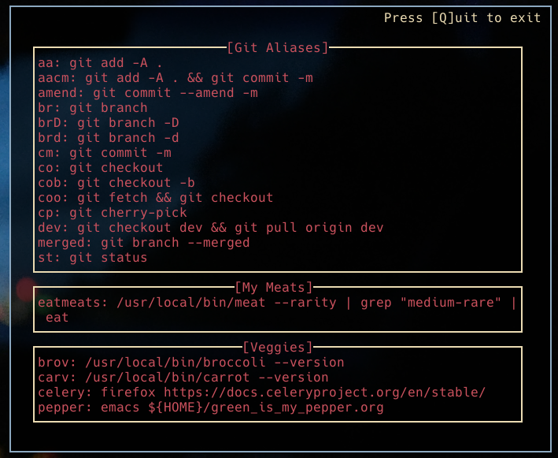

# alias-panel
Spit out a simple cheat-sheet for your Bash aliases onto the CLI.

# Setup

```console
git clone https://github.com/BradyBolton/alias-panel
cd alias-panel
go build
go install
```

# Configuring

It's probably cleaner to seperate your aliases from your `.bashrc` like so:
```console
if [ -f $HOME/.bash_aliases ]; then
    . $HOME/.bash_aliases
fi
```

This way, you just point `alias-panel` to parse only those files, either by:
* Naming your files `<name>_aliases`, leaving the utility to pick up on any of those files found in `$HOME`
* Setting `$ALIASFILES` to a `:` delimited list of complete paths of your alias files (just like `$PATH`)

Example: I have one file `$HOME/.local_aliases` which contains aliases for the specific machine I'm on. I then set aside `$HOME/.bash_aliases` containing aliases that I use for all machines (stuffed away in a personal Git repo along with all the dotfiles). So then:

```console
export ALIASFILES="/path/to/.bash_aliases:/path/to/.local_aliases"
```

The files defined in the `$ALIASFILES` will contain _sections_ which `alias-panel` will look for as a way to group aliases together so they appear in pretty frames. Just make a comment with the `SECTION` directive, with an appropriate name following a colon. Any aliases underneath that section will become part of that section:

```console
...
# SECTION: Veggies
alias carv="/usr/local/bin/carrot --version" # get carrot version
alias brov="/usr/local/bin/broccoli --version" # get broccoli version
alias pepper="emacs ${HOME}/green_is_my_pepper.org"
alias celery="firefox https://docs.celeryproject.org/en/stable/"

# SECTION: My Meats
alias eatmeats="/usr/local/bin/meat --rarity | grep "medium-rare" | eat" # eat only medium-rare meat
...
```

The alias `carv` is under the section `Veggies`, and so it will appear in the frame for `Veggies`, likewise, `eatmeats` falls under the `My Meats` section.

# Running

Running the example above:

```console
alias-panel
```



# :scroll: TODO list :scroll:

Some very important things I need to finish:

- [X] Stack section panels vertically, from left to right
- [X] Make margins configurable via optional argument
- [X] Make logging configurable via optional argument
- [X] Account for undefined order when iterating maps in Golang
- [ ] Make things prettier (colors, bold, etc.)
- [ ] Show (optional) alias comments/descriptions 
- [ ] Add paging (with vim-like controls?)
